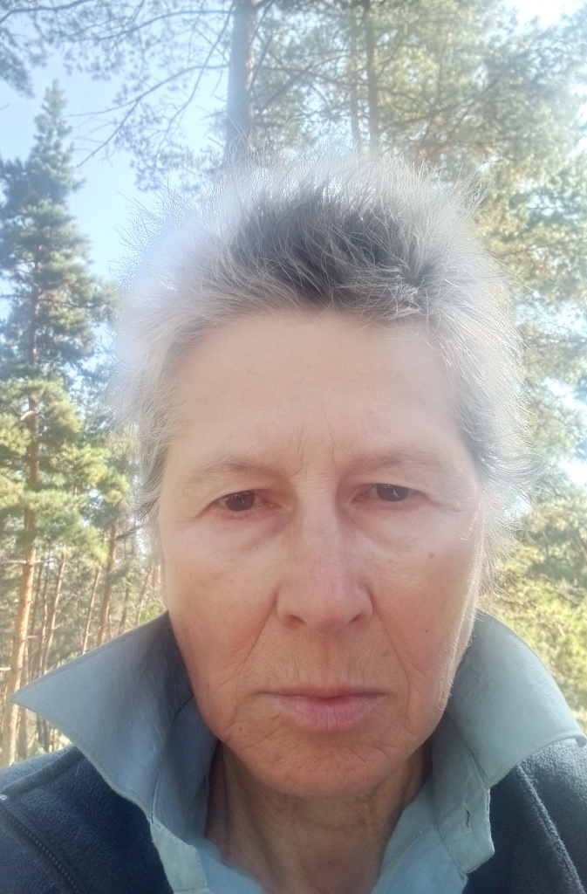
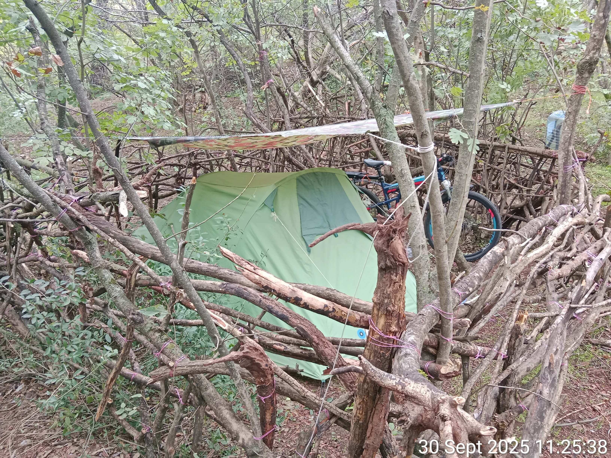
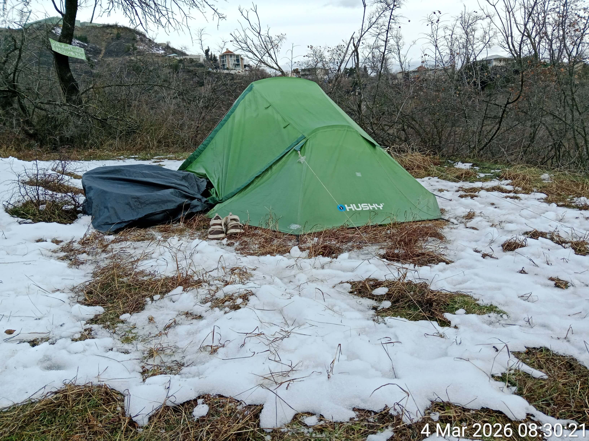

[**Main Page**](index.md)

# ABOUT THE AUTHOR AND THE CONDITIONS OF THE PROJECT’S CREATION

*It was in this tent, that the 
Encyclopedia of Orthodox Military Putinism was created.*

*It was in this tent, that the 
Encyclopedia of Orthodox Military Putinism was created.*

## Flight and Denial of Asylum 

On April 24, 2024, at the age of 66, I was forced to flee Russia to escape persecution by Russian secret services, whose goal was my physical elimination. However, the persecution continued abroad — in Turkey and Georgia, countries with a massive presence of Russian intelligence agents. 

On September 29, 2024, I applied for asylum in Switzerland, providing evidence of the impossibility of my return to Russia.
However, the processing of my case by the State Secretariat for Migration (SEM) of Switzerland was accompanied by gross procedural violations: I was denied an adequate translation of the Interview Protocol, my answers were distorted by the interpreter, my key evidence was ignored by the SEM, and the Decision was based on fabricated circumstances and false "facts." A scheduled medical examination was canceled without explanation. As a result, my asylum claim was groundlessly rejected, and I was deported to Georgia, where I found myself again under persecution, this time amidst a humanitarian catastrophe.

## Survival Conditions 

For two years, I, a 68-year-old single woman, lived in a tent on the street, without access to basic human living conditions:

•	Cold and Heat: In winter, the temperature in the tent drops below zero degrees Celsius. In summer, it rises to 50°C.

•	Lack of Medicine and Hygiene: Impossibility of receiving medical care or any form of treatment (no conditions for storing medication). Impossibility of washing or laundering clothes.

•	Minimal Resources: Nutrition consists of dry rations and cold water. Lack of electricity, heating, air conditioning, and refrigeration. Lack of gas, winter gear, warm clothing, and footwear.

## Systematic Cross-border Persecution 

My situation is not merely a matter of lacking housing, medical care, and adequate living conditions. I am being subjected to constant and systematic cross-border persecution by the Russian secret services:

• Incitement of widespread hatred and hostility among the local population, fueled by slander, insinuations, and fabricated "evidence."

• Assassination attempts disguised as accidents, including deliberate tampering with my bicycle's braking system.

• Infliction of bodily harm, including targeted and systematic attacks on my eyes.

• Intimidation, death threats, and physical violence.

• A targeted campaign of sleep deprivation, utilizing electronic devices placed around my campsite programmed to emit deafeningly loud noises at intervals.

• Deliberate property damage, specifically targeting my tent, air mattress, and bicycle.

• Institutional sabotage within the service sector, involving the intentional sale of substandard or hazardous goods.

• Unprecedented digital terror: the hacking of my smartphone and relentless cyberattacks designed to obstruct my creative work (including the sabotage of AI tools, the destruction or alteration of data, and the creation of persistent technical barriers).

• A heinous act of psychological pressure: the murder of my mother in Russia on October 20, 2025.

## Creativity as Resistance: An Act of Survival and Aid 

The goal of this persecution is simple: to kill me or break me. They want me silent, back in Russia, or dead. That is why I stay vocal. I continue to live and create in spite of everything — the technical hurdles, local hostility, living conditions bordering on torture, psychological warfare, and lack of any medical support.

As a writer, satirist, and artist, my work exposing the war and the Putin regime is blacklisted across all major Russian-language and several international platforms. This total censorship is the ultimate validation of my work; it proves that my words carry ideological weight.

This project is my response to those trying to destroy me. In conditions bordering on inhuman treatment, I create texts to:

•	Expose the relentless tide of political madness, lawlessness, lies, cynicism, and cruelty.

•	Command global attention toward those suffering under authoritarianism and war.

• Mobilize that attention into tangible aid by directing readers to verified support funds for Ukraine.

Every word you read was written under the strain of hunger, cold, constant persecution, and despair.

This is more than literature. It is a testament to an unbroken will,  courage, and active resistance. And simultaneously — a tool to help those like me: the victims, the displaced, and the desperate.

## The Peak of Persecution
On May 27, 2026, an attempt was made on my life. Two burly men climbed over the fence at night, ransacked my campsite in the Vake hills, and spent an entire hour beating, torturing, tormenting, and mutilating me. They broke at least five of my ribs and punctured my lung.

Pneumothorax, hemothorax, fifty blows to the head, a ruptured eardrum, and multiple contusions and hematomas.

The thugs robbed me of all my money, two phones, chargers, power banks, and even a power strip — in short, all of my work tools — as well as 7 memory cards containing archives and my international passport. With pure hypocrisy, they told me to show up at the Russian consulate the next morning to get my passport back.

Then they left me to die on the hilltop. They deliberately deprived me of any opportunity to reach a hospital or call emergency services. The descent from the mountain is steep and rocky; descending at night without a flashlight, with a pneumothorax when you cannot breathe, when your eye is swollen shut, your glasses are lost and you cannot see, when your knees are trembling from the sheer terror and unbearable pain, and your mind is frozen from stress... This is exactly what they anticipated — that I would lack the strength and courage, that I would stumble and break my neck, fall off a cliff, suffocate, or lose consciousness.

But I made it down. Summoning the last of my strength, I crawled down into Vake Park, where, fortunately, I immediately crossed paths with people who called the police and an ambulance.

## SUPPORT THE AUTHOR
If you liked this book, if it made you think or laugh (through tears), please support the author to the best of your ability. The thugs stripped me of all my savings; my medical treatment cost over 4,000 GEL (money I had to borrow), and I now require long-term rehabilitation, proper housing, food, and medication.

**MY WALLET:**

0x55D4819973eC8573dD2E4f709E366363804E1F18

Network: Polygon (only Polygon!!!)

Currency:

USDT (Polygon)

USDC (Polygon)

MATIC / POL

Any amount is welcome. Thank you for reading. And for being on the right side of history.

[**List Of Charitable Foundations Assisting Ukraine**](en_funds)

[**Main Page**](index.md)
