[**Main Page**](index.md)

# RISING OFF HER KNEES 
**ONE-ACT PLAY IN THE GENRE OF "MEDIA COUNTERPOINT"**

**For the 72nd anniversary of Putin's birth**

**Author: Shcheglova Olga (Boris Bidyaga)** 

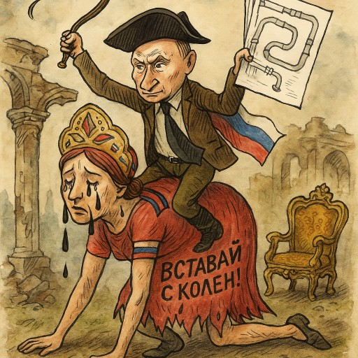

### CHARACTERS: 

– Russia

– Putin, who calls himself the president of Russia

**[Scene opens]**

> Russia is kneeling, gazing pensively into the void. Enters Putin, dressed in military uniform, boots with spurs clanking. Sees Russia and snaps.

**Putin** (irritated): 

— Holy crap! Back on your knees again? What did I tell you? I lifted you up! For God's sake!

**Russia** (hopeful):

— Oh my darling, is it really you? What a surprise! I’d almost lost hope... Tell me, my love... Where’ve you been, what’ve you done?

**Putin** (gloomy): 

 — Been to war.

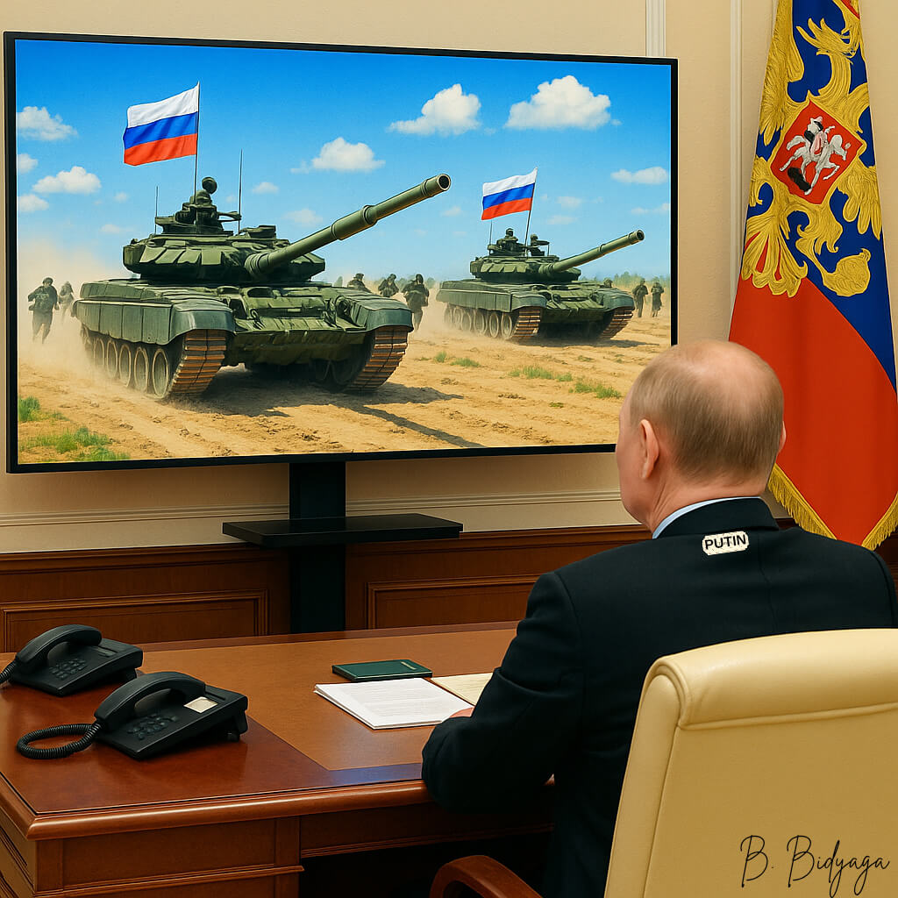

**Russia** (curious): 

— War? Why start a war? Did someone offend you? Pick a fight? Hurt your feelings?  

**Putin** (with hatred): 

— That arrogant bitch next door…

**Russia** (lively): 

— Which one? Left or right?

**Putin** (sullen): 

— Left. Got it into her head she’s a sovereign nation… Sovereign, my ass. Yellow-blue whore… bastard child of our history. That’s all she is!

**Russia** (nodding): 

— Shameless hussy!

**Putin** (contemptuous): 

— And guess who she made president?

**Russia** (naive): 

— Who?

**Putin** (spiteful): 

— A clown, for Christ’s sake. A Jew, too. Belongs on a stage, not prancing around at podiums! Squirming his way into NATO like a worm...  

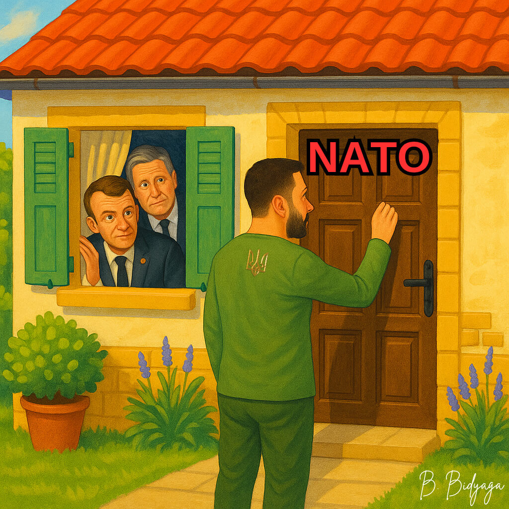

**Russia** (contemptuous): 

— NATO? Him? Ridiculous! Like a pig at a banquet…

**Putin** (fervent): 

— Exactly, damn it! A pig’s place is in a pigsty! Stay home, slurp your beet soup, grunt in peace. But nooo — she grunts at every damn summit, squealing for her rights. And nobody gives a damn about mine! 

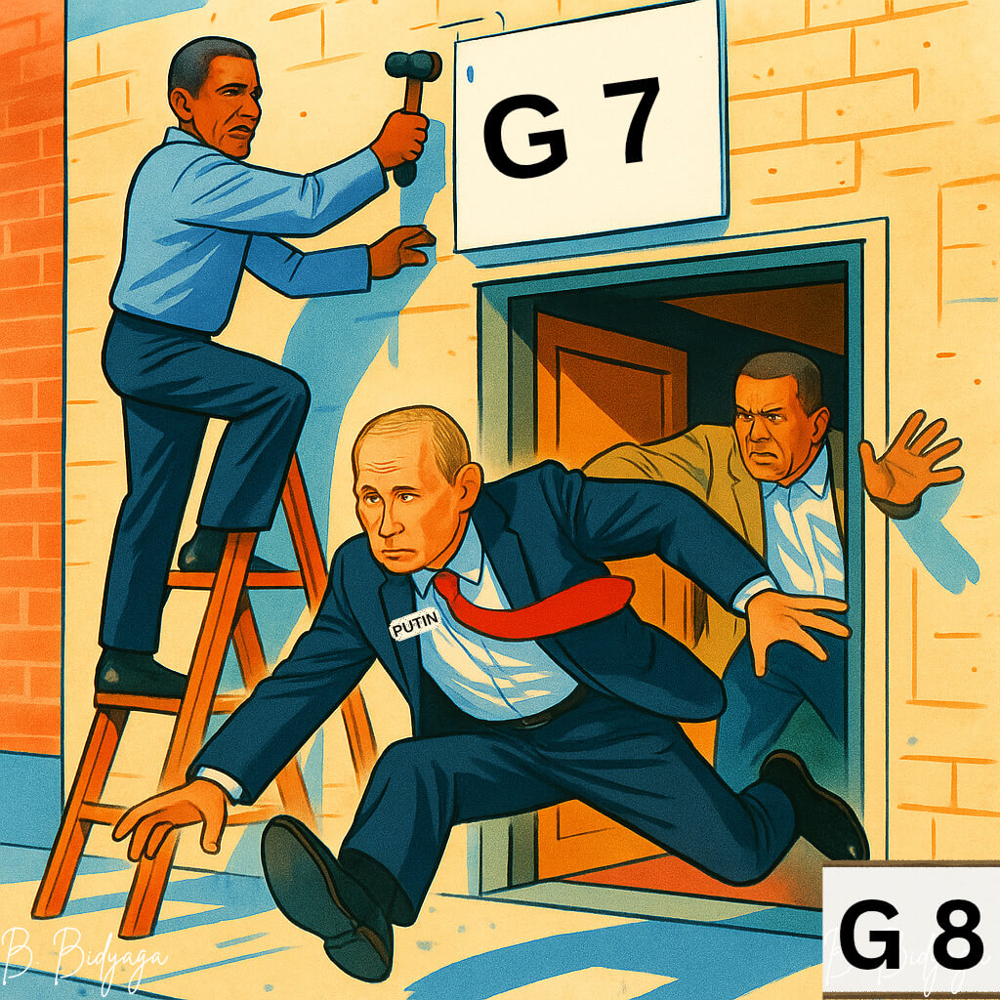

**Putin** (continues):

— Holy crap! She’s squatting on my ancestral land, sucking it dry like a tick. Land that’s rightfully Russian soil... Holy Rus’ stood there! Prince Vladimir the Fair Sun sat on his throne! Fought the Pechenegs and the Polovtsy!

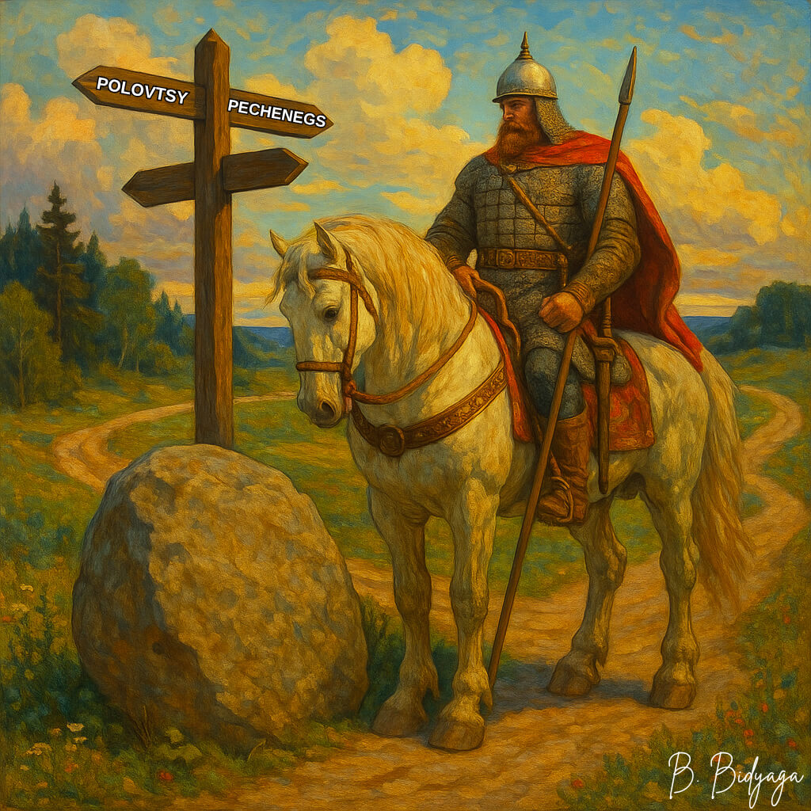

**Russia** (insinuating): 

— Don’t you have enough land already?

**Putin** (anguished): 

— Holy crap, woman! What land? Swamps? Tundra? Frozen wastelands? You can’t grow shit there. But her? Black soil. Breadbasket of the world…

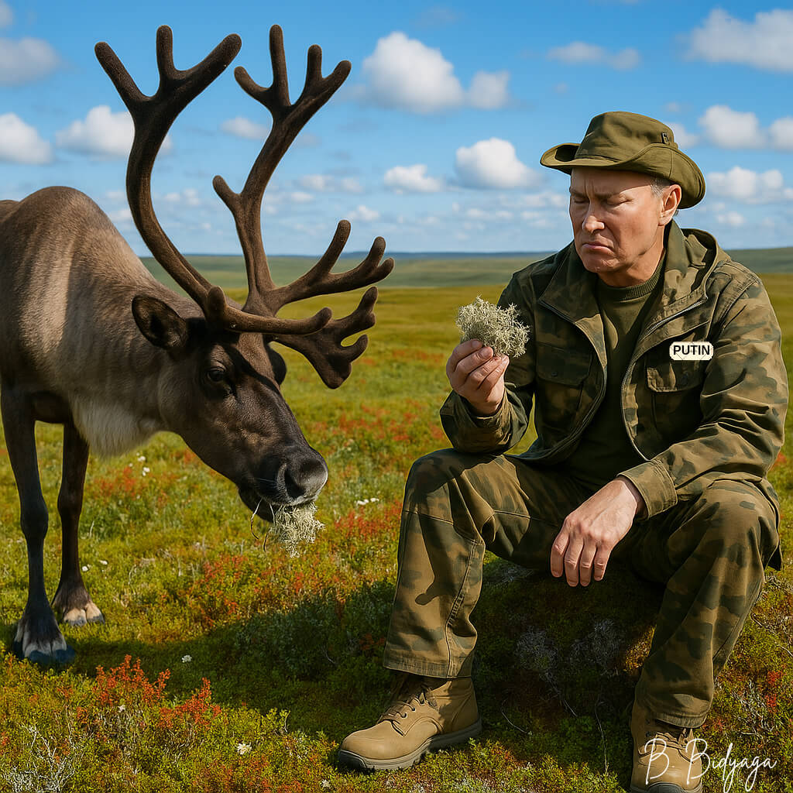

**Russia** (reproachful): 

— Disgraceful!

**Putin** (melancholic): 

— And the factories, the mines, the power plants — we Russians built all those! With these hands! [*Looks at his hands solemnly.*] How'd she take them? By what right?

**Russia**:

— Hey, why are your hands kinda… red?

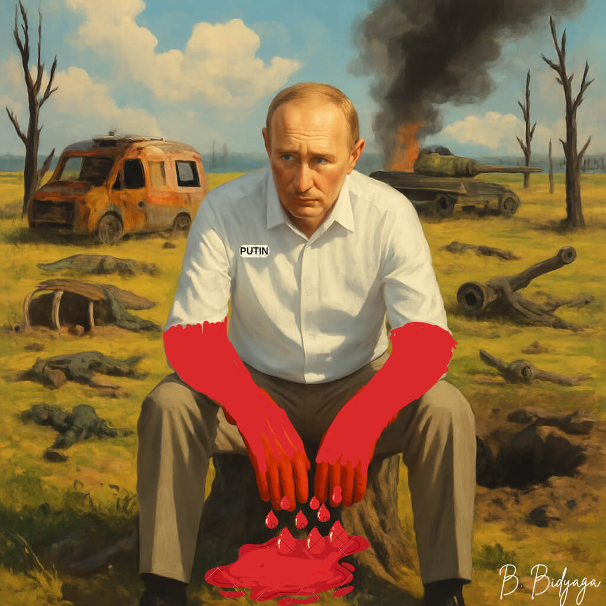

**Putin** (dismissive): 

— Holy crap, woman! You’re seeing things. My hands are fine. Go get your eyes checked. For God’s sake!

*(Pause.)*

**Putin**:

— Anyway, what I was trying to say… This damn neighbour of yours… she’s insulting our people: won’t even let them speak Russian. Can you believe it?

**Russia** (angrily): 

— I swear on my shoes — I'll pluck every last hair off her head, the insolent little tramp! Did you put her in her place?

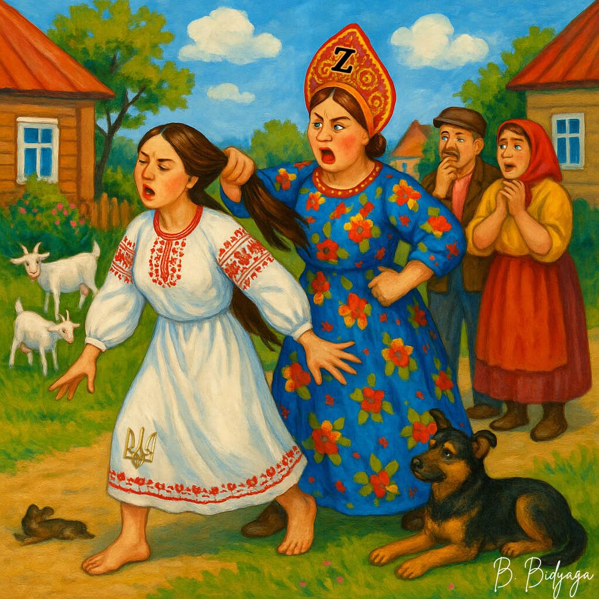

**Putin** (heated): 

— That was my plan exactly...

**Russia** (vengeful): 

— To put her through the ringer?

**Putin** (vicious): 

— Sure as Hell! Through the *Russian* ringer, damn it! To show her what's what!

**Russia** (regretful): 

— But you didn't... Why?

**Putin** (disapproving): 

— The damn slut holed up with the Yankees...

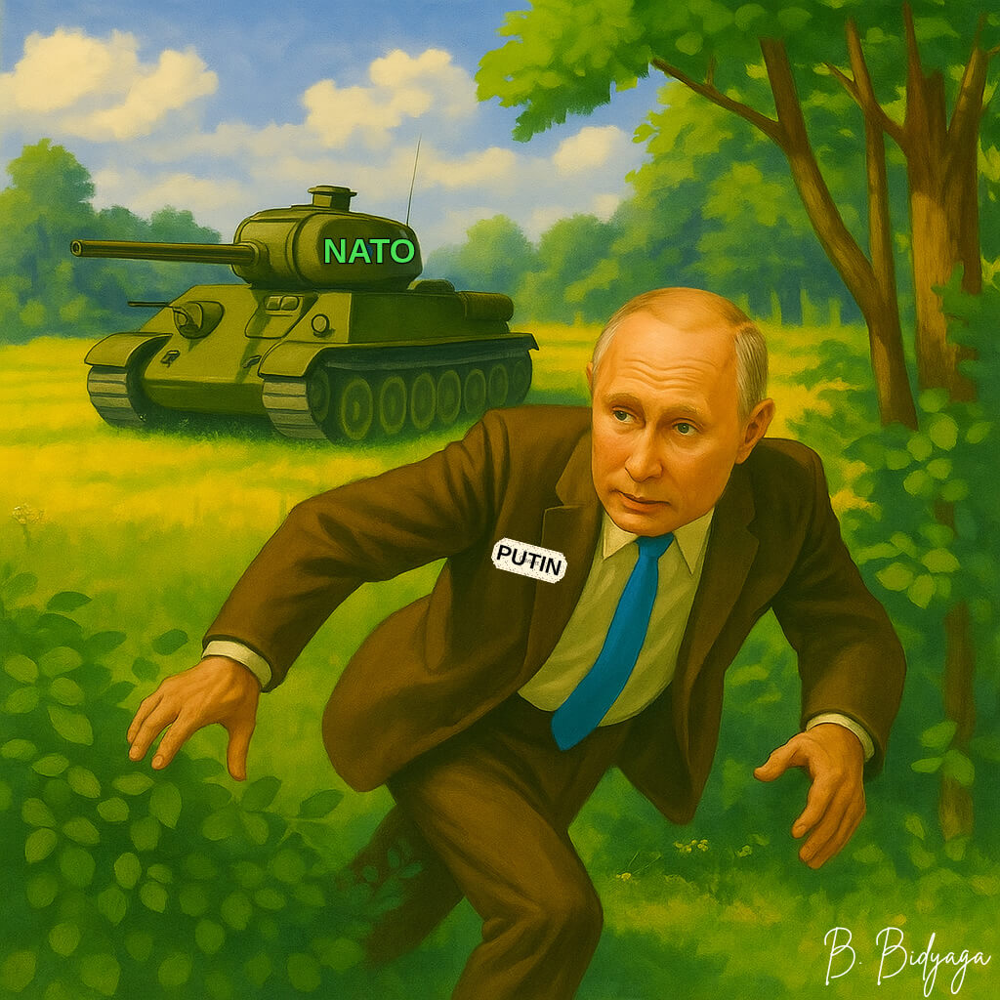

**Russia** (exalted): 

— Oh my! Loose woman!

**Putin** (impatient): 

— That's what I'm telling you, damn it! A dirty slut. NATO's doormat. Nowhere to put a brand. Begging them for weapons. Unbelievable!

**Russia** (distrustful): 

— And they give them?

**Putin** (furious): 

— Damn right they do! Tanks, shells, missiles — morden, top-tier. Better than mine! Damn it! 

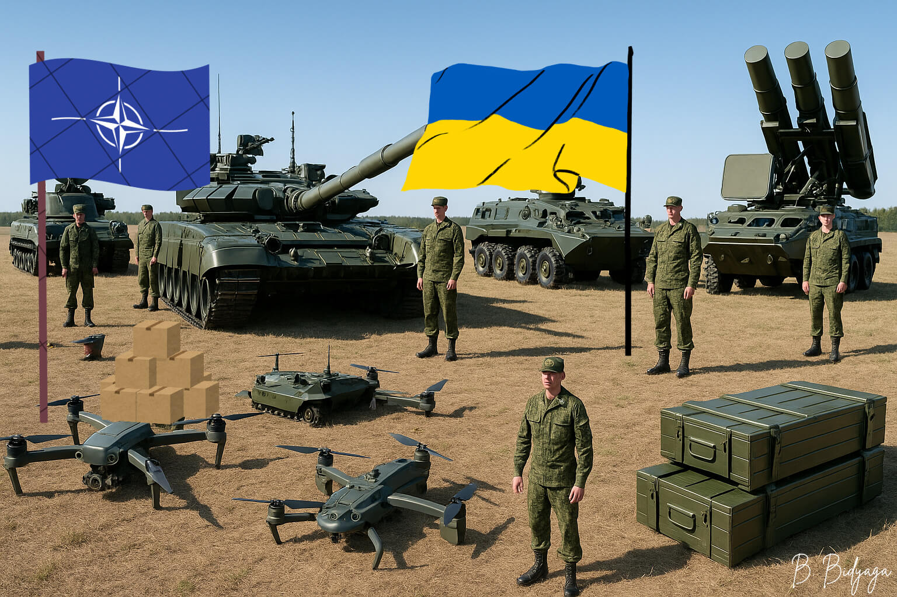

**Putin** (continues):

— Holy crap! They torched my oil depots. A lot. Across the country. They hit their targets with the first shot! Fuck them! I'm out of fuel for the trucks, damn it! My boys are dragging artillery by horse now. Damn it!

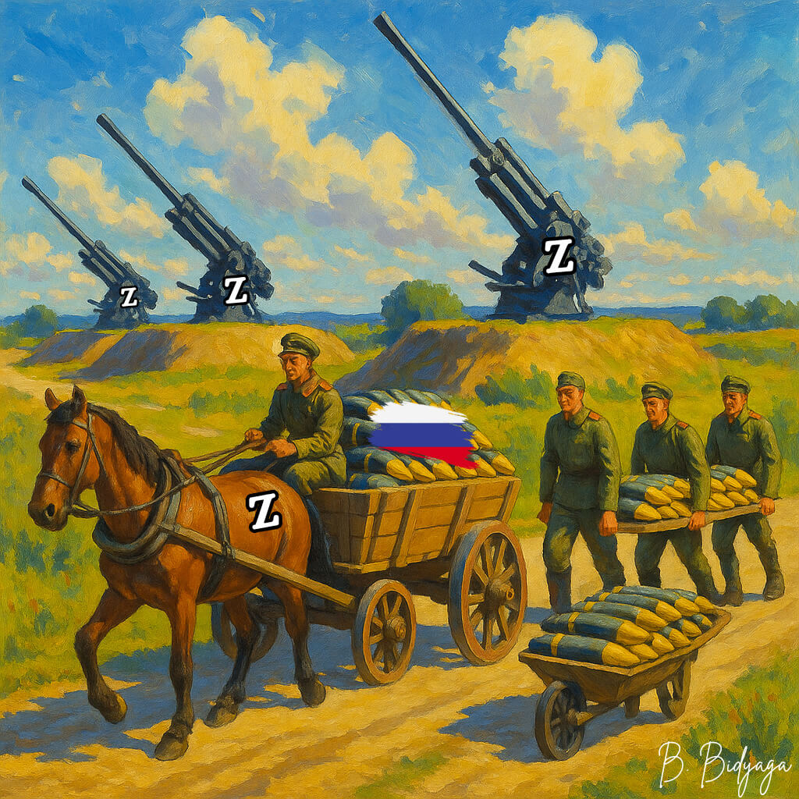

**Russia** (throwing up hands): 

— Oh dear! 

**Putin** (tragic): 

— Rostov refinery was hit so hard — half the damn depot went up like a matchbox. Still blazing, five days straight, damn it! Half a billion dollars down the drain! 

**Russia** (regretful): 

— What a shame! You haven't tried holy water, have you? Sprinkled from a helicopter? 

**Putin** (sighing): 

— Tried every damn thing! Prayers, relics, priests in a conga line… 

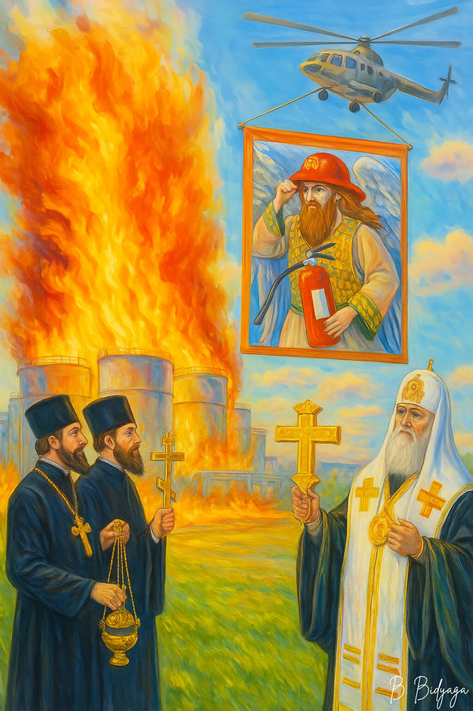

**Russia** (worried): 

— Still nothing? Did you walk with the censer?

**Putin** (frustrated): 

— Holy crap, woman! Of course we did! Three times! 

**Russia** (instructive): 

— Maybe they went in the wrong direction? Should be sunwise!

**Putin** (emphatic): 

— That's exactly what we did! Clockwise! By the Book!

**Russia** (suprised): 

— And it didn't work?!

**Putin** (shaking head): 

— Not a damn bit!

**Russia** (gasps, prays, then shrieks): 

– Holy heavens! Blessed saints! They’ve cast the evil eye on you, my darling! Aye, they’ve hexed you! Damn scoundrels, foreign infidels! Alas, alas! What is to be done? Only a sorceress can help now!

**Putin** (irritated):

– What sorceress? What the hell are you talking about?! 

**Russia** (wailing):

– Gotta mutter the spell on water… Guard the servant of God Volodymer from the flying serpent, from the creeping serpent, from wicked fate… Enemy, Satan, ill-wisher, get away from him — like beast from beast, snake from snake, heretic from heretic, warlock from witch… Ptui, ptui, ptui! [*Spits thrice over her left shoulder, each time crossing herself.*]

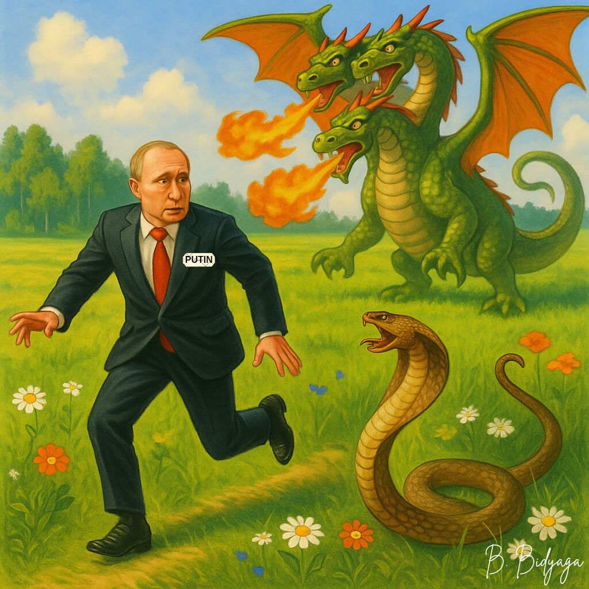

**Putin** (angry): 

— Holy crap, woman! Are you out of your freaking mind? Flying serpent?!

**Russia**: 

— Listen to me! A water spell, that's what we need: "Deliver thy servant from the serpent…" Three sprinkles at dawn — boom, fixed! 

**Putin** (skeptical): 

— You really think that’ll work?

**Russia** (fervent): 

— It always does. And splash some on your oil depot too. Be sure to do it at dawn. Not during the day, not at night. Do you understand?

**Putin** (thoughtful): 

— Where do I find this... sorceress?

**Russia** (eager): 

— Every church has one. Ask around. Good souls are everywhere. Surely somebody will help you. 

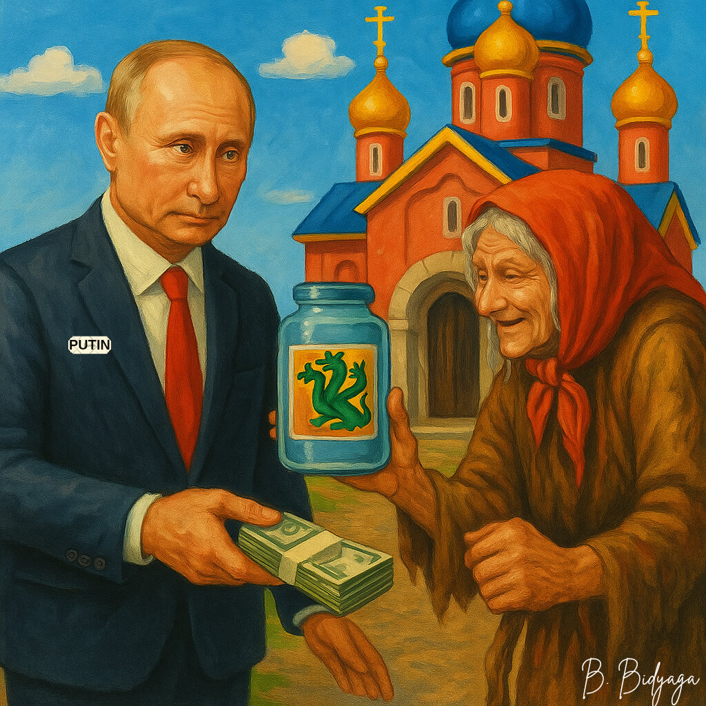

*(Pause.)*

**Russia** (nervous): 

— Oh! And one more thing. Avoid black cats! If one crosses you — oops! You are doomed! 

**Putin** (boastful): 

— Holy crap, woman! I scare those bastards with a mere glance. One bolted just yesterday! 

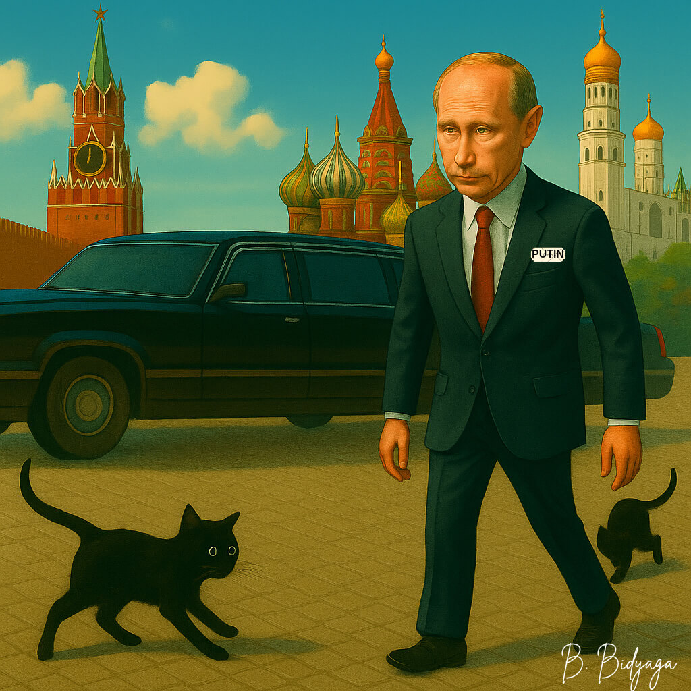

**Russia** (approving): 

— That's my boy!

*(Pause.)*

**Russia** (humble):

— And this wicked enemy of yours... You never thought of a love potion? For peace? 

**Putin** (devilish smirk): 

 — We've already treated him to a "love potion"... From our secret laboratory. Didn't work.

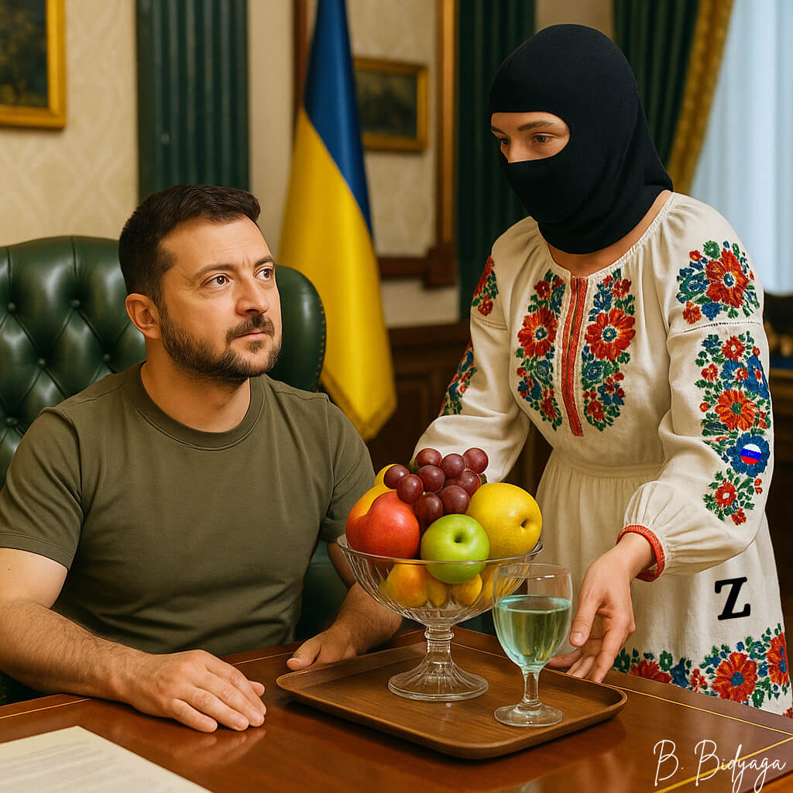

**Russia** (thoughtful): 

— Then I'll give you a really good one. Bury a frog in an anthill. At night. In two weeks, you'll find a magic hook and a magic spade there. Secretly attach that hook to his coat — he’ll wither! As sure as sunrise.

**Putin** (arrogant): 

— Holy crap, woman! Forget frogs! I could kill him without fairy tales. It’s the 21st century, damn it! 

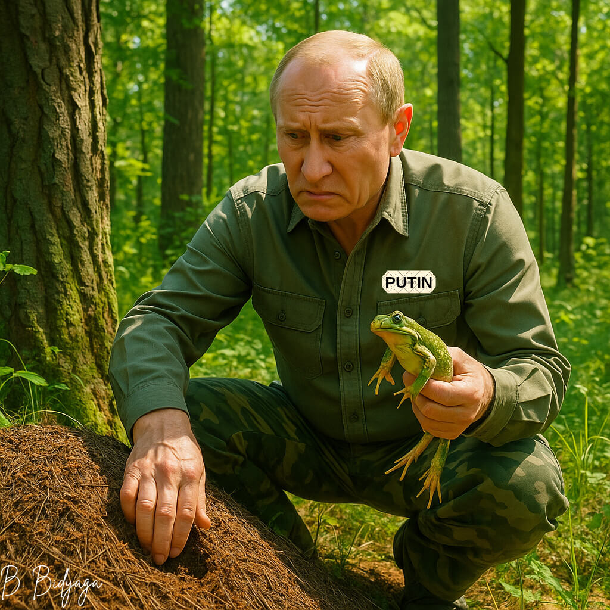

**Russia**: 

— So?

**Putin** (gloomy): 

— So what? Who guarantees they won't retaliate? It’s a two-way street, damn it! 

*(Pause.)*

**Putin** (bitter): 

— After all, now they’ve got airplanes. American ones. F-16s. Damn it! You think it’s just a plane? Damn, no! It's a fiery bloody dragon! Fighter, bomber, interceptor — three in one, damn it! 

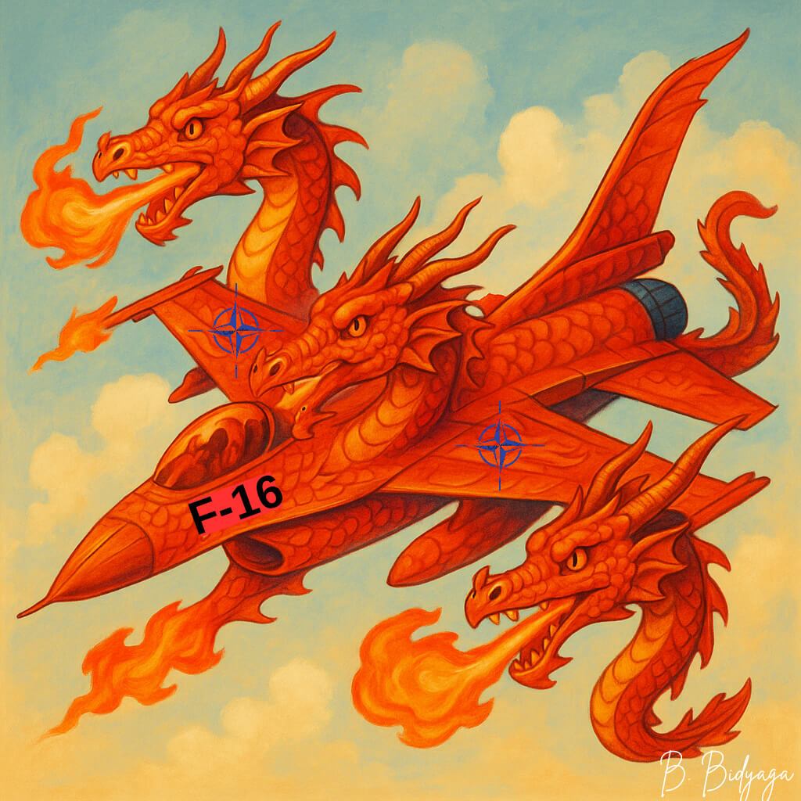

**Russia** (hostile): 

— Good heavens! Who invented this monster?

**Putin** (shouting): 

— They’ve got phased-array radar, for God's sake! Can see his target 350 km ahead! Damn it!

**Russia** (batting eyelashes foolishly): 

— Who? 

**Putin** (frenzied):

— The pilot, damn it! In the cockpit!

**Russia**: 
 
— Hell-spawned devil!

**Putin**:

— Through fog, clouds, darkness — he sees everything! 

**Russia** (astonished): 

— Impossible! Are you sure?

**Putin** (frenzied):

— Don't you get it? He sees me in the Kremlin! 

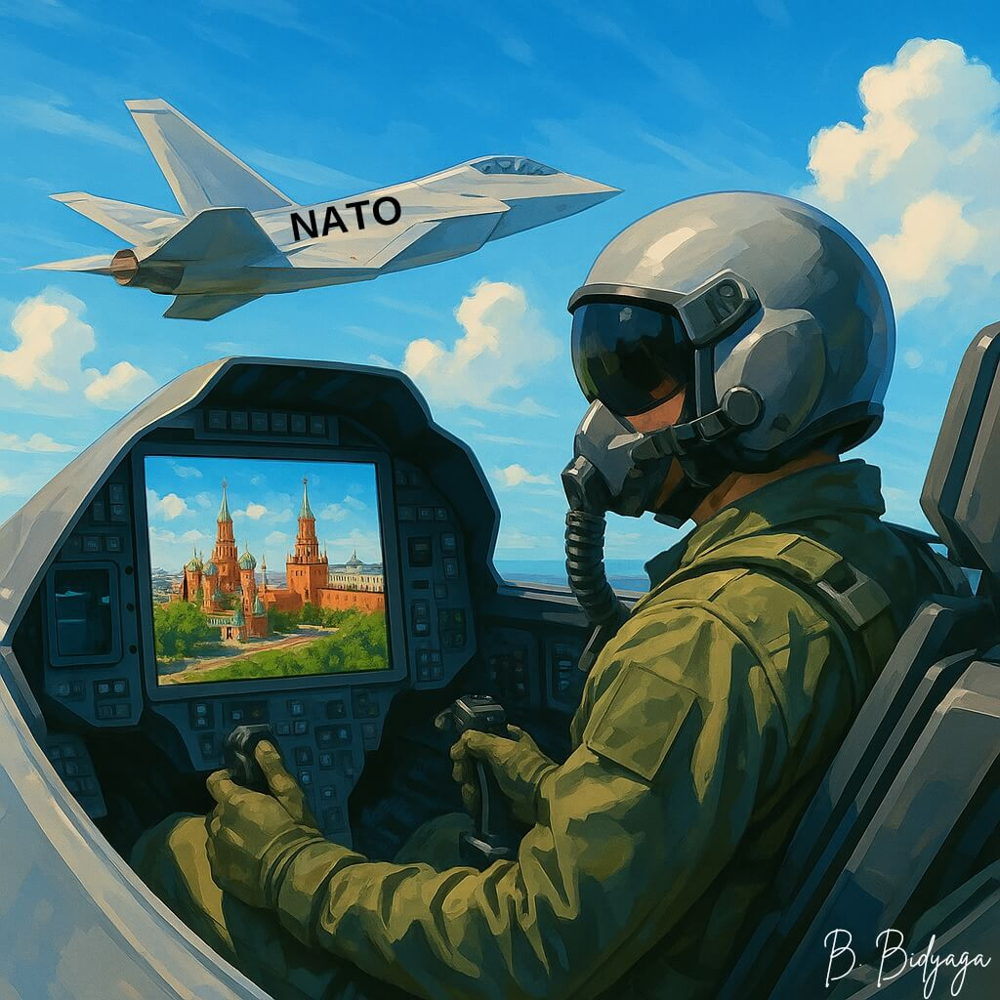

**Russia** (doubtful): 

— I guess the Kremlin’s a bit farther than 350 km…
 
**Putin** (indignant): 

— Damn right, it is! So what? They violate borders! Spit on international law! Cross my red lines! Yellow-blue gangsters! Nazis with jammers! 

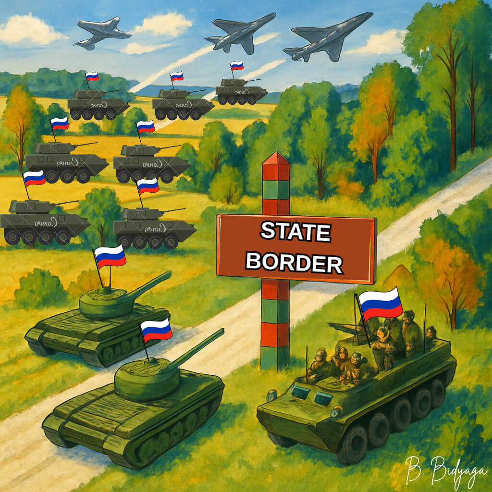

**Russia** (flashing eyes): 

— Dear me!  But where’s this... what do you call it... the UN?!

**Putin** (with utmost contempt):

– The UN... A wind chime. Damn it!

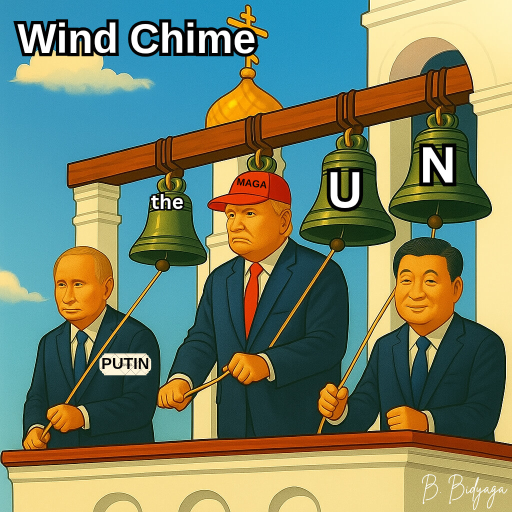

*(Pause.)*

**Putin** (raging): 

— And their jammers? You see? They are better than NATO’s! He can see me just fine, but he himself — invisible! I’m fucking blind! God damn it!

**Russia** (confused): 

— Who?

**Putin**:

— The damn pilot! With his turnip system! 

>Note: in the Russian language “turnip" has two meanings:
>1. Radio-Electronic Warfare.
>2. Traditional vegetable

**Russia** (furious): 

— They stole our turnip! Our traditional value! Hands off our turnip, heathens! Choke on your corn tortillas!

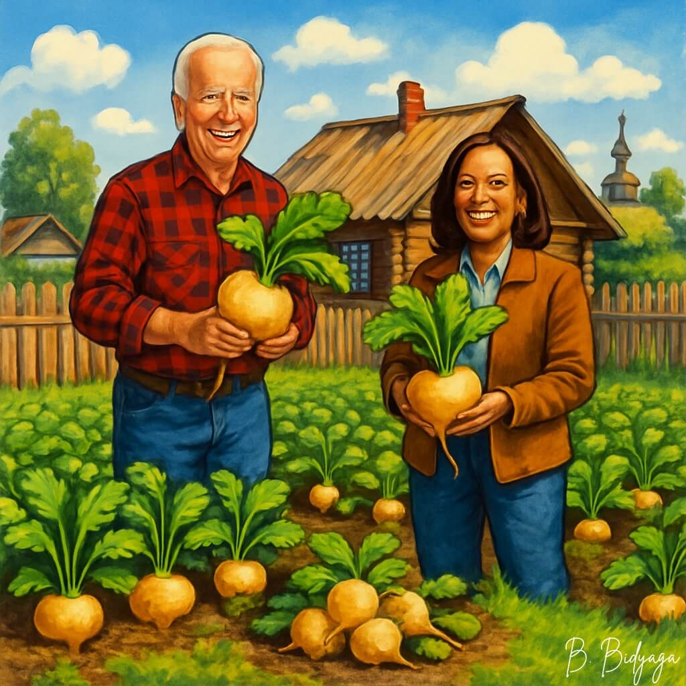

**Putin** (bitter laugh): 

— Calm down. Not that turnip!

**Russia** (suspicious): 

— GMO then?

**Putin** (irritated): 

– Holy crap, no! It's jammers! Electronic warfare! They knock my radars out completely! And here you go — an invisible plane, damn it! This isn’t a war — it’s a fucking fairy tale!

**Russia** (with a sigh, almost lamenting):

– What are you saying? Looks like you’re playing blind man’s buff with them? 

**Putin** (with a bitter smirk):

– Exactly! A goddamn war of blind man’s buff! That's what it is! 

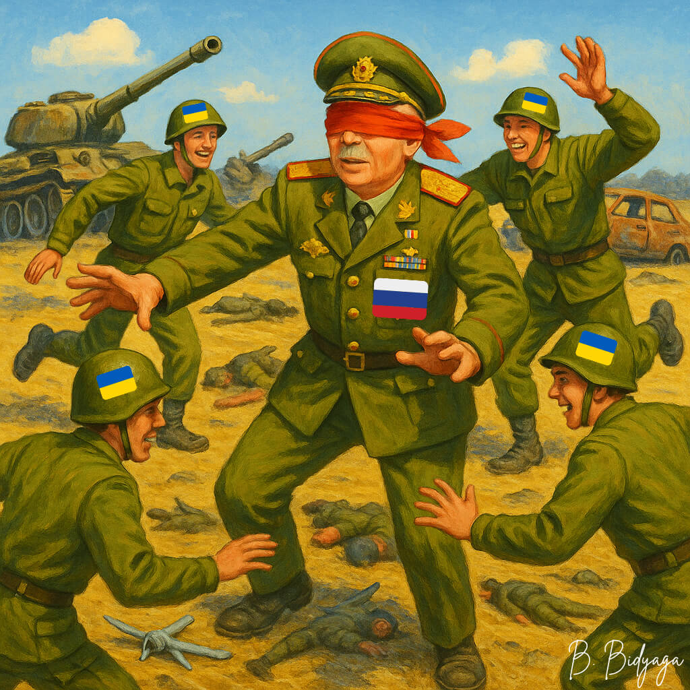

*(For a moment, silence. Putin broods, his face black as thunder. Russia, disapprovingly, noiselessly moves her lips.)*

**Putin** (suddenly snapping, shaking his fists in fury):

— Goddamn Yankees! 

**Russia** (sympathetic): 

— Sure. Vile people. No peace for the Russian soul. Obama, that bastard, the other day, pissed in **all** our elevators. Raised gas prices too… Some president he is!

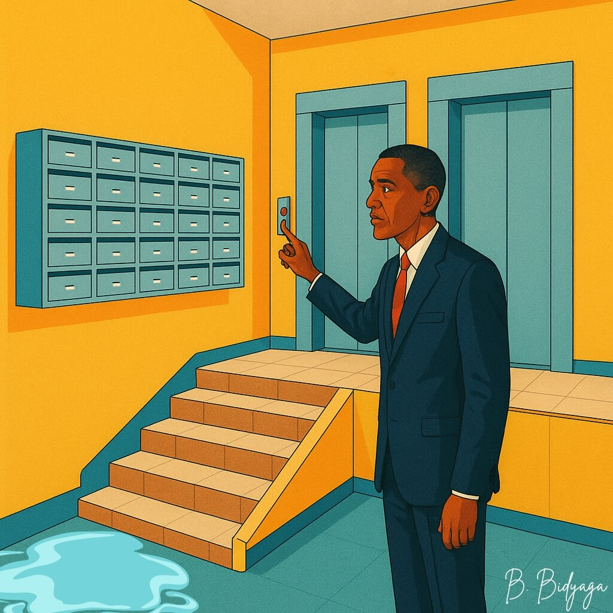

**Putin** (furious):

— Holy crap, woman! Wake up! Obama’s been gone for ages! It’s Biden now!

**Russia** (nodding eagerly):

— That’s what I’m sayin’. Biden. We oughta go and piss in all his elevators too… Over there in that place… what’s it called again… the White House. Too damn white. Hurts the eyes. Maybe if it got a bit yellow, it’d look more like a normal house. Who does he think he is, struttin’ around like he’s better than us?

**Putin** (exasperated): 

— Holy crap, woman! What's with you and elevators?

*(Silence. Russia guiltily stares at the floor.)*

**Putin** (pensive): 

— You know what?

**Russia** (eager):

— What, my beloved?

**Putin** (slowly):

— This war, you know... I think aliens might be... involved...

**Russia** (interrupting, fearful): 

— What?! Aliens?! From another planet?!

**Putin** (raging): 

— Damn right! Aliens! From another Galaxy. A cosmic Nazi conspiracy. With NATO standing behind it. Gender-neutral bastards! Parent One, Parent Two! 
**XenoGalAgents!** 

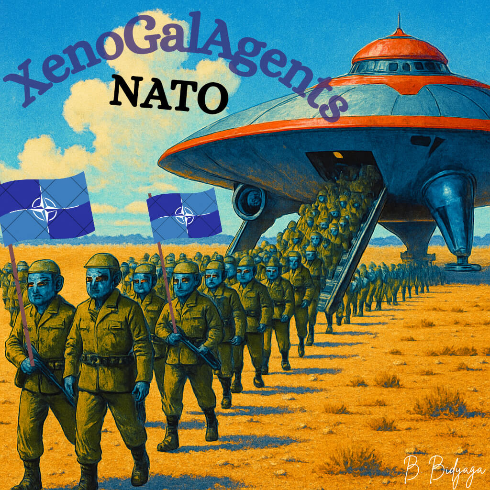

**Putin** (screaming):

— If that’s the way you treat me, I’ll blow the whole damn Universe to hell!

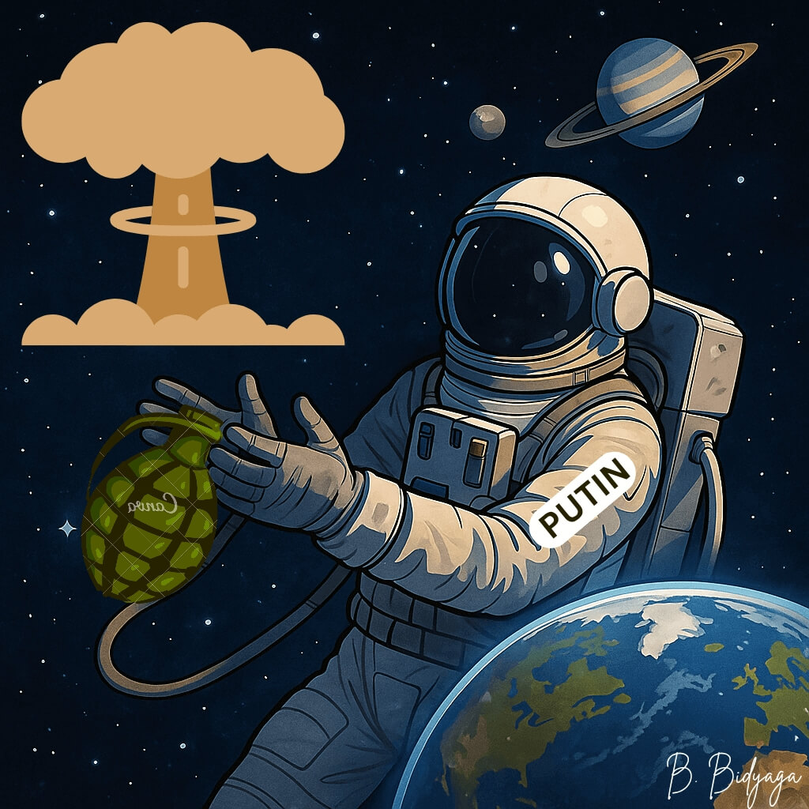

*(Russia shrieks, then starts praying and banging her head on the floor.)* 

**Putin** (calm, mumbling): 

— Gender-neutral intergalactic scum, damn it! With no primary sexual characteristics. Thank god, we are not like them. At least our genitals are real… 

*(Putin checks out his primary sexual characteristics. Nods approvingly.)*

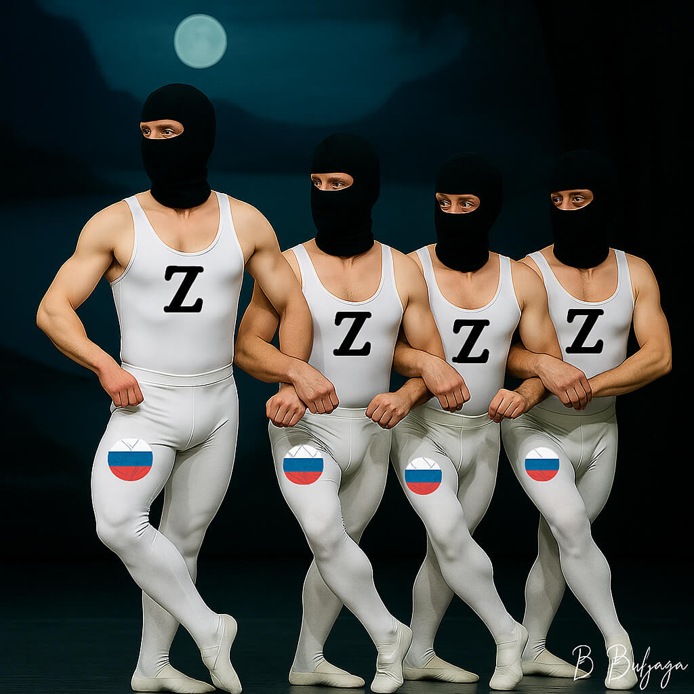

**Russia** (nervous): 

— You OK?

**Putin** (grim): 

— Holy crap, woman! Do I look okay? Damn it! Betrayal everywhere. High command selling the Motherland wholesale and retail! Generals gift-wrap my tanks and sell to the enemy — right across the front line! Ribbons on the gun! 

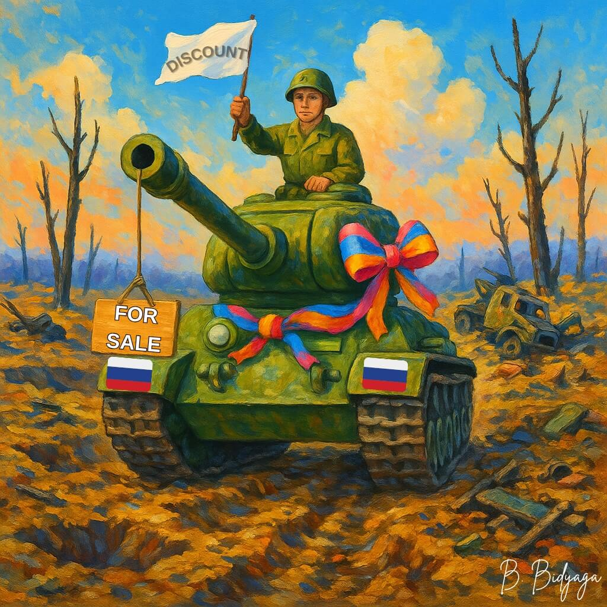

**Putin** (continues):

— Holy crap, steal at peace time: knock yourself out! Be my guest! But during the war?! Bastards! Show some respect, for God’s sake!

**Russia** (sympathetic): 

— So you are being robbed too. Perfect! Just dandy!

**Putin** (waving hand hopelessly): 

— There's no point talking… 

*(He pauses, lost in thought.)* 

**Putin** (crooked smirk): 

— Enough gloom, damn it! Let’s do something… fun!

**Russia** (nodding): 

— Of course, my love!

*(Putin approaches Russia, removes his jacket, grips her sides — recoils the very next moment.)*

**Putin** (shocked): 

— Holy crap, woman! You’re skin and bones! Where’s the meat? 

**Russia** (dull): 

— I have no idea. I eat like always… but I’m wasting away. 

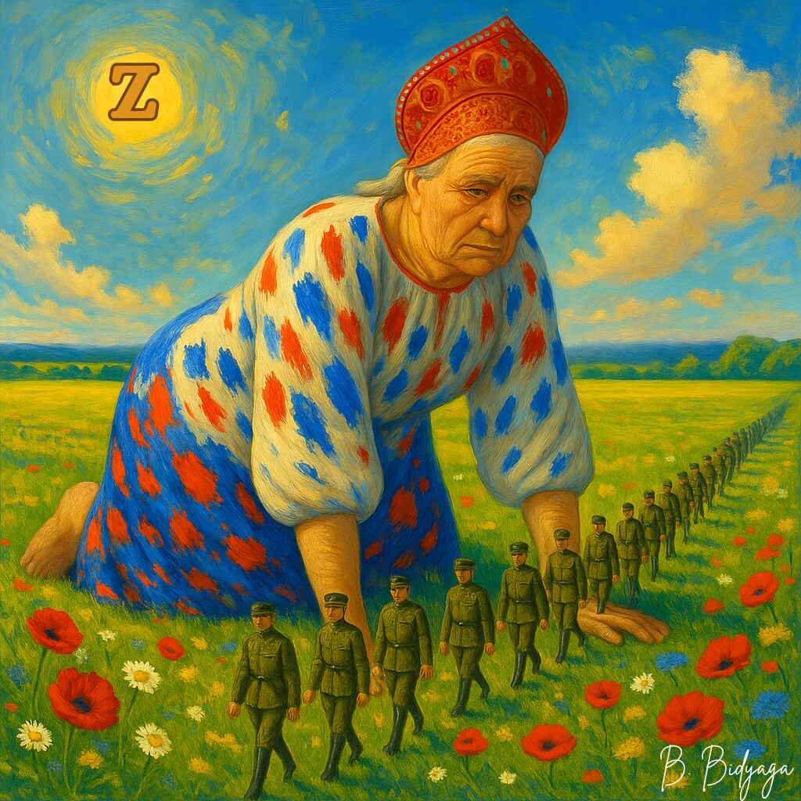

**Putin** (anxious): 

— Since when did this start?

**Russia** (straining): 

— Today’s August two thousand twenty-four?

**Putin**: 

— Yes, August 24th.

**Russia**: 

— Let me see... It looks like two and a half years now. 

**Putin** (confused): 

— But why?

**Russia** (angrily): 

— Look! The cursed fiends, sworn foes of the Russian soul... They unleashed their witcheries — hexes, omens, snares of dark enchantment!
 
*(Silence. Putin hesitates, then grips her again.)*

**Putin** (gently): 

— Come on, sweetheart. Rise up.

**Russia** (stubborn): 

— Why? I’m fine down here.

**Putin** (affectionate, caressing Russia's back): 

— Stand up, my love. 

**Russia** (coquettish): 

— I thought this position was your favourite. Last time you moaned like a groom on the wedding night.

**Putin** (snapping):

— Moaned or not — who the hell cares, huh? What counts is — I need fresh trophies. New territo... — uh, I mean, new damn gas pipe... — damn it! New positions, that’s what I’m after, you know? And you — don’t you crave something new yourself, huh?

**Russia** (shrugging): 

— New — just the old in disguise? Why not?… Let’s try something new.

**Putin** (with relief): 

— That's my girl! 

*(Pause.)*

**Putin** (meditating aloud, ironically): 

 — And why do I love you, you old fool?

**Russia** (sighing): 

— I am big and rich... I mean — I was rich…

**Putin** (dreamy): 

— Yea... and now I am rich.

*(Pause: Putin scrutinizes Russia for a minute or two.)*

**Putin** (astonished):

— Hm... You’ve aged, my dear… Not looking so good anymore...

**Russia** (offended):

— Well, when a whole co-op rapes you day and night… what else do you expect? No rest, no peace with those parasites.

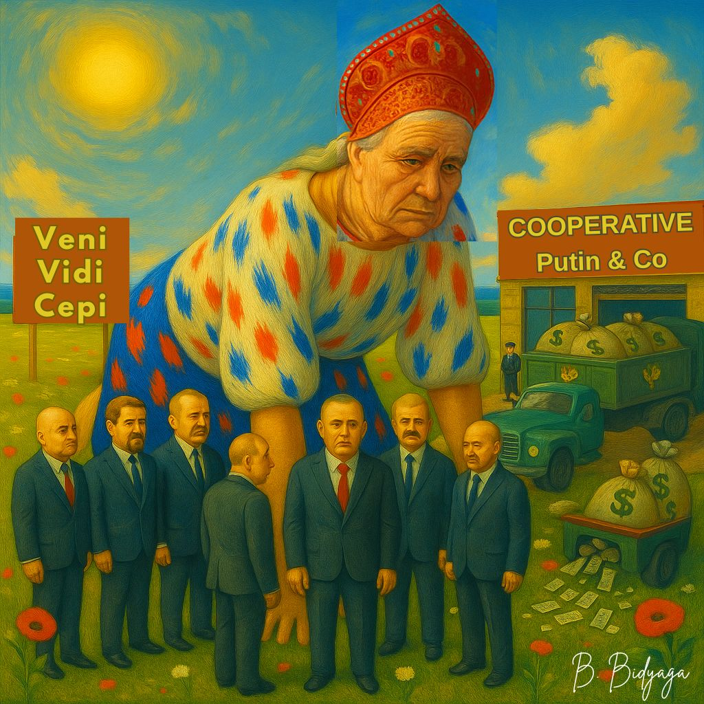

**Putin** (arrogant):

— Holy crap, woman! Easy now, watch your mouth! They’re my friends, for God’s sake! And you — I don't get it! You ought to be proud, damn it! No shame in giving yourself to a decent guy, right? And they’re all fine men — I swear on my mama's grave! You should take it as an honor! Damn it! 

**Russia** (reluctant):

— To a decent guy? Why not, perhaps… But that much greed? It's… tasteless. 

**Putin** (conciliatory):

— Come on, look at you. You’re huge. You can take it.

*(Pause.)*

**Putin** (with a lecherous grin):

— Now then, my darling… shall we try a new position?

**Russia** (groaning, struggling to rise but collapsing again):

— I’m too damn tired. Can’t even stand. To hell with your tricks! Let’s stick to the old stuff.

**Putin** (snapping):

— Enough of your whimpering! Stand up! Now!

**Russia** (whimpering, confused):

— But… why?

**Putin** (pompously):

— Better to die on your feet than live on your knees!

**Russia** (terrified):

— Don’t say “die,” my darling! Why should we die at all?

**Putin** (aside, smirking):

— From orgasm, sweetheart. From orgasm.

**Russia** (astonished, naïve):

— Really? You can die from that?

**Putin** (didactic, almost mocking):

— Of course. If the pleasure is strong enough… and the body weak.

**Russia** (delighted, eyes shining):

— To die in your arms… what an honor, my love!

**Putin** (indifferent, shrugging):

— Mmm. If you say so.

*(Pause: he strokes her absent-mindedly.)*

**Putin** (voice thick with desire):

— Now tell me… how much you love me...

**Russia** (rapturous):

— I love you, oh, how I love you! Seventy-eight point nine percent! Ask Gallup — they’ve got numbers for everything! They won’t lie!

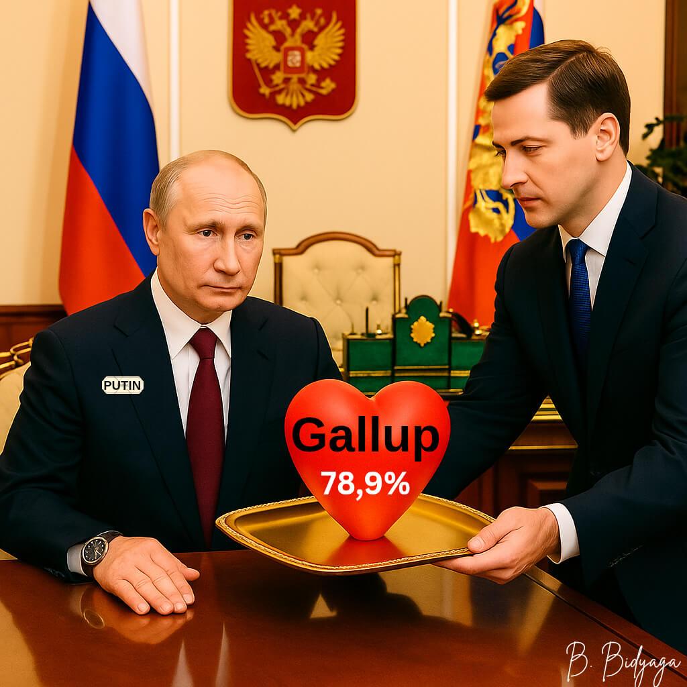

**Putin** (lightly digging a spur into Russia's flabby flesh, mocking):

— And what’s the percentage now?

**Russia** (moaning — pain mixed with bliss):

— So good! More, my love — more!

**Putin** (driving the spur deep):

— Like this?

**Russia** (in delirious ecstasy):

— I’m coming! Oh Lord — I’m coming! Holy Mother of God!

*(Short pause. Russia slowly sinks to the floor.)*

**Russia** (weak, meditative):

— It looks like… I’m dying… Are you with me, my love?

**Putin** (cold smile):

— Holy crap, woman! Me? Never. I’ve got better things to do. And why should I die? I'm young and strong...

**Russia** (slurring, in despair):

— But didn’t Volodin say: “No Putin — no Russia”?

> **[Note: Vyacheslav Volodin — Speaker of the Russian State Duma.]**

**Putin** (icily):

— Fortunately, the reverse isn’t true. Russia may vanish — but I remain.

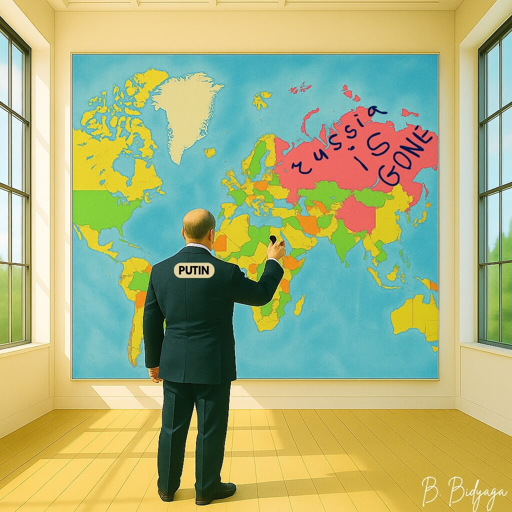

*(He watches with disdain as Russia convulses, dying at his feet. Then, without a glance back, he turns and walks away.)*

#OrthodoxMilitaryPutinism
                              👻
                              
*September 24th 2024*

*Turkey — Georgia* 

**© Olga Shcheglova, 2024**  

[**List Of Charitable Foundations Assisting Ukraine**](en_funds)

[**Main Page**](index.md)

